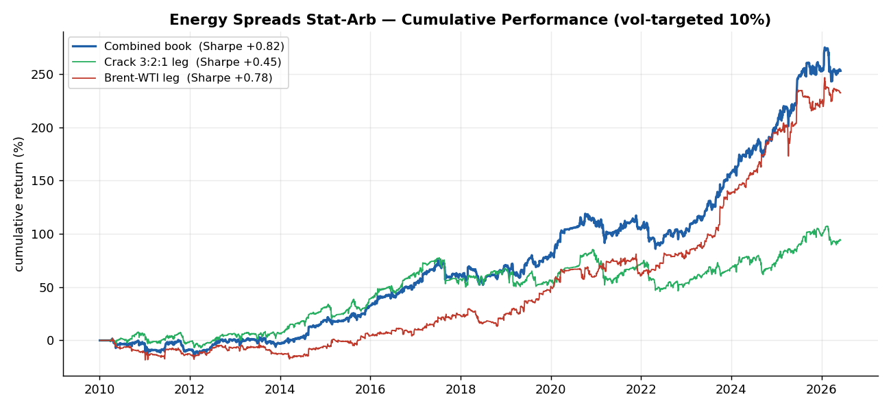
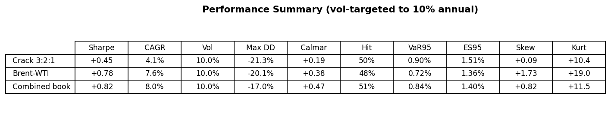
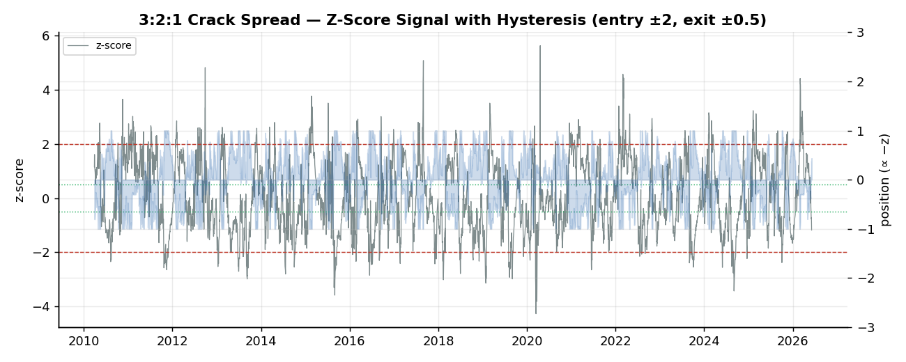
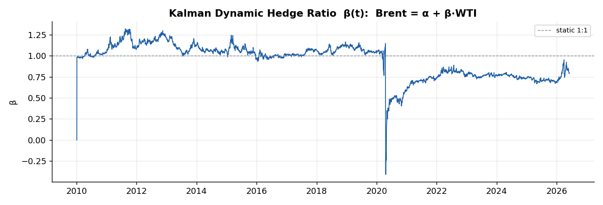
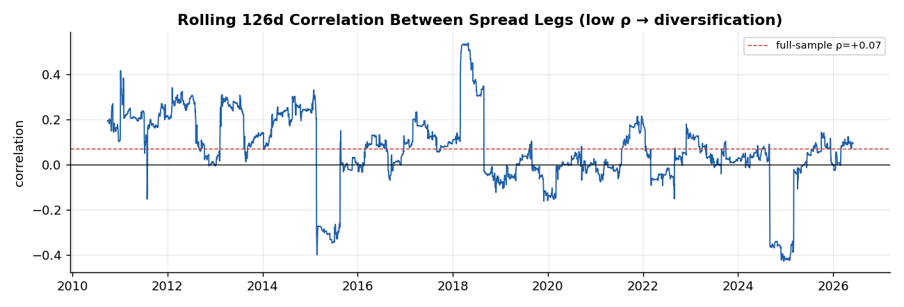
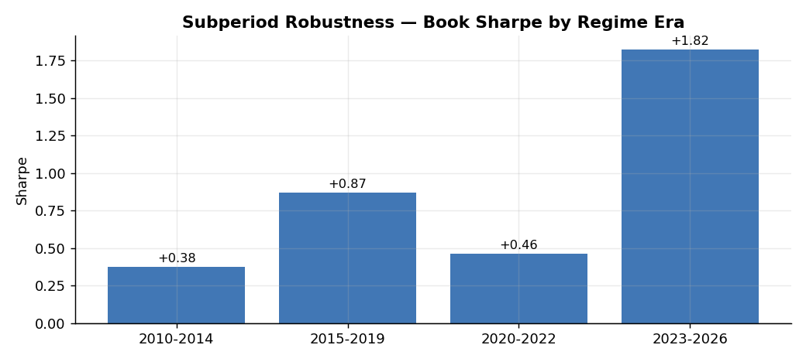
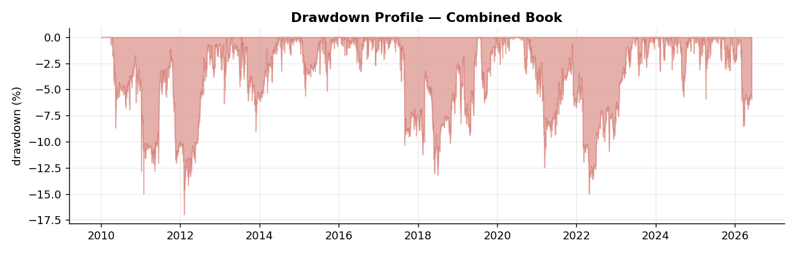

# LSEG Energy Spreads Statistical Arbitrage Engine

> A market-neutral commodities **relative-value** strategy combining the **3:2:1 crack spread** and the **Brent–WTI** futures spread, using LSEG data, Ornstein–Uhlenbeck mean-reversion diagnostics, z-score signals with hysteresis, a **Kalman dynamic hedge ratio**, and transaction-cost-aware, look-ahead-free backtesting.



## Why this project matters

This is **not an oil-price predictor**. Forecasting an outright commodity price is close to forecasting a random walk. Instead, this engine trades **economic relationships** that arbitrage forces back toward equilibrium:

- **Crude vs refined products** — the 3:2:1 crack spread (refining margin).
- **Brent vs WTI** — the quality/logistics basis between the two crude benchmarks.

It is a disciplined, risk-controlled **statistical-arbitrage** project: mean-reversion diagnostics, futures-spread construction, dynamic hedging, and an honest backtest.

## Key results (2010–2026, vol-targeted to 10% annual, after costs)

| Strategy | Sharpe | CAGR | Vol | Max DD | Calmar | Hit |
|----------|:------:|:----:|:---:|:------:|:------:|:---:|
| Crack 3:2:1 | +0.45 | +4.1% | 10.0% | −21.3% | +0.19 | 50% |
| Brent–WTI (Kalman) | +0.78 | +7.6% | 10.0% | −20.1% | +0.38 | 48% |
| **Combined book** | **+0.82** | **+8.0%** | 10.0% | **−17.0%** | **+0.47** | 51% |

The two legs are weakly correlated (**ρ ≈ 0.07**) → the combined book genuinely diversifies. OU half-lives: **crack 61d**, **Brent–WTI 39d**.



> Honest by design: Sharpe ≈ 0.8 is a *real but modest* edge, not a money printer. All metrics come straight from the code — nothing inflated.

## Methodology

**Spread construction & units**
- 3:2:1 crack = `[2·RBOB·42 + 1·HeatOil·42 − 3·WTI] / 3` ($/bbl). The ×42 converts $/gallon → $/barrel.
- Brent–WTI = `LCOc1 − CLc1` ($/bbl).

**Roll-robustness** — Continuation futures (`cN`) are not roll-adjusted, but **spreads cancel most roll jumps** (legs roll on similar schedules). Residual jumps winsorized at 0.5%/99.5%.

**Mean-reversion (OU half-life)** — AR(1) estimate of the decay speed; finite, short half-lives confirm the spreads are tradable.

**Signal** — rolling 60d z-score; **continuous** sizing (position ∝ −z, clipped ±1); entry ±2, exit ±0.5.



**Kalman dynamic hedge ratio** — Brent–WTI uses a time-varying β(t) from a Kalman filter (`Brent = α + β·WTI`); the look-ahead-free innovation is the signal. β dislocates at the April-2020 negative-oil shock and resets near 0.75 — a regime a static 1:1 hedge would miss.



**Diversification** — low rolling correlation between the two legs.



## Risk controls

- **No look-ahead bias** — z-scores use only past data; positions are `shift(1)` before being applied to returns.
- **Costs at the right step** — charged on realized turnover (position change).
- **Regime filter** — exposure cut to 30% when spread vol exceeds its trailing 90th percentile.
- **Vol targeting** — book scaled to 10% annual vol for interpretable risk.
- **Automated integrity checks** (`src/strategy.py: quant_checks`) — NaN, date alignment, signal lag, cost timing, no-future-data.
- **Subperiod robustness** — performance shown across four regime eras.




## Limitations

- Vol-normalized PnL scaled to a 10% target — not a sized dollar book with modeled fills/liquidity.
- Continuation-series & roll approximations; winsorization uses full-sample quantiles (outlier clipping only).
- Brent (ICE) and WTI (NYMEX) roll on slightly different schedules → residual roll noise.
- **Research only — not investment advice.**

## Repository structure

```
energy-spreads-statarb/
├── README.md
├── requirements.txt
├── data/raw_prices/          # LSEG continuation futures CSVs (CLc1, LCOc1, RBc1, HOc1)
├── src/
│   ├── data.py               # load / fetch (LSEG) prices
│   ├── models.py             # OU half-life + Kalman dynamic hedge ratio
│   ├── strategy.py           # signals, backtest engine, quant_checks
│   ├── metrics.py            # vol targeting + performance/risk metrics
│   └── plots.py              # publication-quality figures
├── scripts/
│   ├── run_backtest.py       # metrics + integrity checks → data/results.csv
│   └── generate_report.py    # figures (docs/assets/) + tearsheet (reports/)
├── docs/assets/              # PNG figures
└── reports/strategy_tearsheet.md
```

## How to run

```bash
pip install -r requirements.txt

# (optional) refresh data from LSEG — requires an active Workspace session
python -c "from pathlib import Path; from src.data import fetch_from_lseg; fetch_from_lseg(Path('data'))"

python scripts/run_backtest.py        # backtest + metrics + integrity checks
python scripts/generate_report.py     # figures + tearsheet
```

*Built with Python (pandas, numpy, matplotlib). Data: LSEG / Refinitiv continuation futures.*
